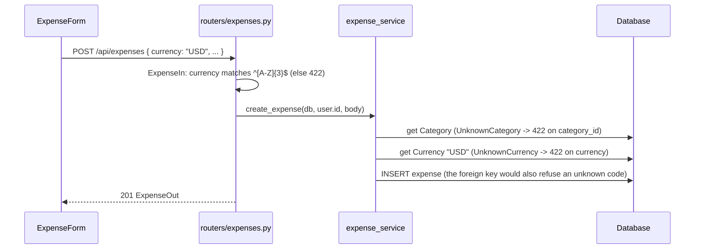

# EM-10 Data Flow: Currency Dropdown from the Database

This document explains what EM-10 changed and how the list of currencies moves from the database to the Add expense form, and how a chosen currency is checked when an expense is saved. It builds on [EM-5-add-expense.md](EM-5-add-expense.md).

Design references: [data_model.md](../planning/references/data_model.md), [database.md](../planning/references/database.md), [api_design.md](../planning/references/api_design.md), [frontend.md](../planning/references/frontend.md).

## 1. Overview

```
 migration 0005                GET /api/currencies             Add expense form
┌──────────────────┐  SELECT  ┌───────────────────────┐  JSON  ┌──────────────────────────┐
│ currencies       │ ───────► │ [{code, name}, ...]   │ ─────► │ Currency                 │
│ 155 ISO 4217 rows│  by code │ sorted by code        │        │ [AUD - Australian Dollar▾]│
└──────────────────┘          └───────────────────────┘        └──────────────────────────┘
        ▲ FK (RESTRICT)                                                   │ POST /api/expenses
┌──────────────────┐                                                      ▼  { currency: "USD", ... }
│ expenses.currency│ ◄──── INSERT only if the code exists (else 422 on currency)
└──────────────────┘
```

| Part | Code | Role |
|---|---|---|
| Migration | `backend/alembic/versions/0005_create_currencies.py` | Creates and seeds `currencies`, then links `expenses.currency` to it |
| Model | `backend/app/models/currency.py` | `Currency(code, name)` |
| Model | `backend/app/models/expense.py` | `currency` is `String(3)` with a foreign key to `currencies.code` |
| Route | `backend/app/routers/currencies.py` | `GET /api/currencies` |
| Schema | `backend/app/schemas/expense.py` | `CurrencyOut`; `ExpenseIn.currency` keeps its format rule |
| Service | `backend/app/services/expense_service.py` | `list_currencies()`; `create_expense()` raises `UnknownCurrency` |
| Errors | `backend/app/routers/expenses.py` | `UnknownCurrency` becomes 422 on `currency` |
| API functions | `frontend/src/api/expenses.js` | `listCurrencies()`, `listExpenseFormOptions()` |
| Form | `frontend/src/pages/Expenses/ExpenseForm.jsx` | Currency `SelectField` built from the list |

## 2. Where the list comes from

The list is the official ISO 4217 "List One" published by SIX on 2026-09-17 (`list-one.xml`). It has 178 distinct codes; the table keeps the 155 national currencies:

| Kept | Left out |
|---|---|
| 155 currencies used to pay, e.g. AUD Australian Dollar, INR Indian Rupee, GBP Pound Sterling, CNY Yuan Renminbi; current changes included (SLE, VED, ZWG, XCG; not HRK, SLL, ZWL, ANG) | 13 codes without a minor unit: gold, silver, platinum, palladium, bond market units, SDR, XSU, XUA, XTS "reserved for testing", XXX "no currency" |
| | 10 fund codes, e.g. USN "US Dollar (Next day)", CLF, CHE |

Leaving out the fund codes also keeps keyboard selection clean: typing "US" lands on USD, not USN.

The rows are written into the migration as literals, the same way the categories are seeded in 0004. A migration then never changes because a library or a website changed. Names are kept as ISO writes them, including "Pa’anga" and "Bolívar Soberano" (UTF-8). The only change made to the source data was removing a trailing space from "Comorian Franc", which a test now guards against.

## 3. Migration 0005

1. `create_table('currencies')`: `code` `String(3)` primary key (`pk_currencies`), `name` `String(100)`.
2. `bulk_insert` the 155 rows.
3. `batch_alter_table('expenses')`: add `fk_expenses_currency_currencies` → `currencies.code`, `ondelete='RESTRICT'`.

The order matters. On SQLite, adding a foreign key rebuilds `expenses` by copying its rows into a new table that already has the constraint, so every stored code must exist first. On PostgreSQL it is a plain `ALTER TABLE ... ADD CONSTRAINT`, which also checks existing rows. If an expense used a code outside the list, the migration would stop instead of leaving bad data behind.

Downgrade drops the constraint, then the table. Verified:
- upgrade → downgrade to base → upgrade on a fresh database;
- a copy of the local database: expenses kept their currencies (AUD, INR, USD), both `expenses` indexes survived the rebuild, the foreign key list shows `currencies.code` with `RESTRICT`, and `UPDATE ... SET currency='XYZ'` fails with `FOREIGN KEY constraint failed`;
- `alembic check` reports that the models and migrations match.

Future ISO changes are new migrations: an added currency is an insert, and a withdrawn one is a delete that fails while any expense still uses it.

## 4. Flow A: loading the dropdown

1. `NewExpense` calls `useAsyncList(listExpenseFormOptions)`.
2. `listExpenseFormOptions()` runs `listCategoriesAndFamilies()` (also used by the dashboard, which does not need currencies) and `GET /api/currencies` in parallel, and returns `{ categories, currencies, families }`.
3. `GET /api/currencies` (authenticated, like every lookup) runs `SELECT code, name FROM currencies ORDER BY code` and returns `[{ "code": "AED", "name": "UAE Dirham" }, ...]`.
4. `ExpenseForm` renders a `SelectField` with one `<option value="AUD">AUD - Australian Dollar</option>` per currency. The form state starts at `AUD`, so AUD is selected. Because each label starts with the code, the browser's built-in type-ahead jumps to a code as it is typed.

## 5. Flow B: saving with a currency



- **Two checks, one message**: the format rule rejects malformed input like `usd` or `1 OR 1=1` before any query. The table lookup rejects a well-formed but unknown code like `XYZ` with the same 422 shape FastAPI uses, `loc: ["body", "currency"]`. The foreign key is the last guard for any write that bypasses the API.
- **In the form**: a 422 on `currency` shows "Choose a currency from the list" next to the dropdown, and every field keeps what the user entered. The browser-side 3-letter check was removed, because a dropdown can only hold listed codes.
- Existing and new expenses store only the code; nothing else about stored expenses changed.

## 6. Tests

| Suite | File | Covers |
|---|---|---|
| Backend integration | `backend/tests/integration/test_expenses.py` | 155 currencies sorted by code, AUD and INR names, no X or fund codes, no stray spaces in names; `XYZ` returns 422 on `currency` and saves nothing |
| Backend unit | `backend/tests/unit/test_expense_schemas.py` | Format rule still rejects `aud`, `AU`, `AUDD`, `A1D` |
| Backend integration | `backend/tests/integration/test_users.py` | All-routes 401 test now includes `GET /api/currencies` |
| Frontend | `frontend/src/pages/Expenses/NewExpense.test.jsx` | Dropdown lists "CODE - Name" with AUD selected; the chosen code is sent; a server 422 on currency shows next to it and keeps the input |
| E2E | `frontend/e2e/expenses.spec.js` | 155 options, typing "US" selects USD, and the expense saves in USD |
| Responsive | `frontend/e2e/responsive.spec.js` | Currency is at least 44px tall at 360, 768 and 1440 px |

## 7. Known limitation

Amounts are stored with 2 decimal places (`Numeric(12, 2)`) for every currency. ISO gives some currencies 0 decimals (e.g. JPY) or 3 (e.g. KWD). That is unchanged by this ticket; a later ticket can add the minor unit from the same ISO list if needed.
