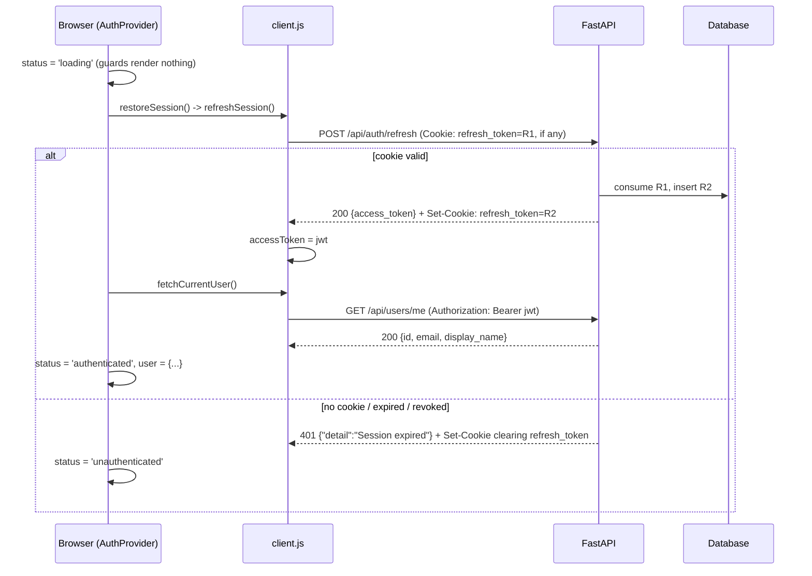
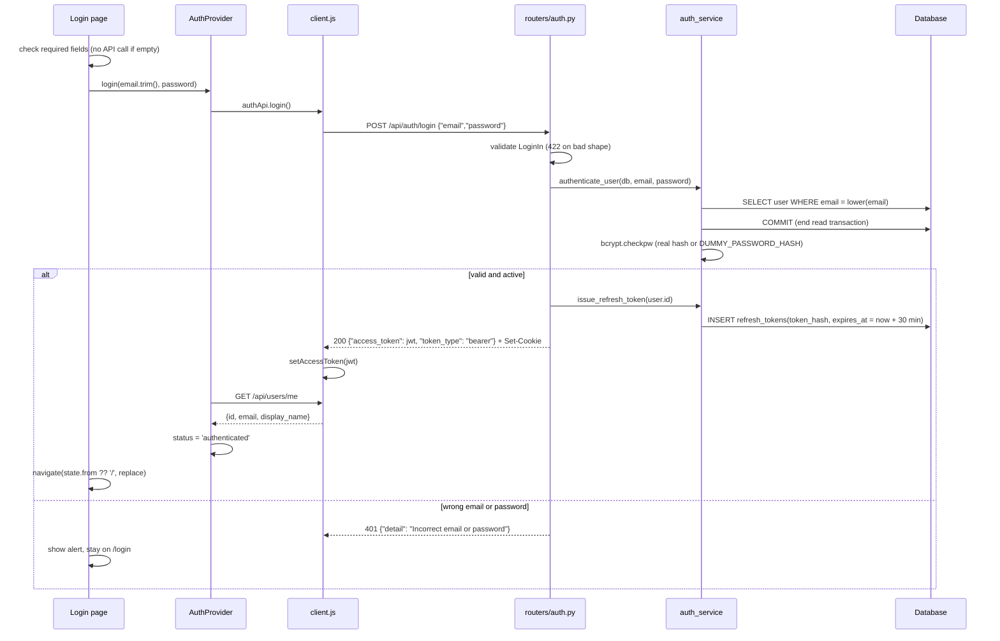
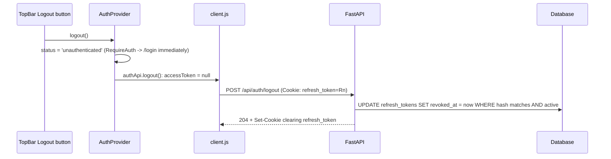

# EM-2 Data Flow: Login, Dashboard and Logout

This document explains how the React frontend and the FastAPI backend exchange data for login, restoring a session, the dashboard greeting, token refresh, logout and idle timeout, and why each design choice was made.

Design references: [authentication.md](../planning/references/authentication.md), [api_design.md](../planning/references/api_design.md), [frontend.md](../planning/references/frontend.md).

## 1. Participants

| Part | Code | Role |
|---|---|---|
| Browser SPA | `frontend/src` | React + React Router. Holds the access token in memory and the user in React context. |
| API client | `frontend/src/api/client.js` | The only place that calls `fetch`. Adds the bearer token, parses JSON, refreshes on 401. |
| Auth state | `frontend/src/auth/AuthProvider.jsx` | Session state machine: `loading` -> `authenticated` / `unauthenticated`. |
| FastAPI app | `backend/app/main.py` | Middleware, `/api` routers, and the built frontend. |
| Auth routes | `backend/app/routers/auth.py` | Public: `/login`, `/refresh`, `/logout`. |
| User routes | `backend/app/routers/users.py` | Protected: `GET /api/users/me`. |
| Services | `backend/app/services/auth_service.py` | Password check, refresh-token issue, rotation and revocation. |
| Database | `users`, `refresh_tokens` tables | SQLite locally, PostgreSQL in production. |

## 2. One origin: how the page and the API are served

```
Browser ──► http://localhost:8080/login          ──► FastAPI catch-all ──► frontend_dist/index.html
Browser ──► http://localhost:8080/assets/*.js    ──► FastAPI catch-all ──► built JS/CSS file
Browser ──► http://localhost:8080/api/auth/login ──► FastAPI /api router
```

- The `Dockerfile` builds the Vite app in a Node stage and copies `dist/` into the Python image as `frontend_dist`. FastAPI serves those files, and returns `index.html` for any other non-`/api` path so deep links such as `/login` work after a reload (`add_frontend_routes` in `main.py`). An unknown `/api/...` path returns a real 404, not the HTML page.
- In production CloudFront plays the same role: `/api/*` goes to API Gateway and Lambda, and everything else goes to S3.

**Why one origin matters for data flow:** the browser treats the page and the API as the same site, so:
- no CORS setup is needed, and `fetch` sends cookies with `credentials: 'same-origin'`;
- the refresh cookie can be `SameSite=Strict`, so another site cannot trigger a request that carries it (CSRF protection);
- the API is addressed with relative paths (`/api/...`); in `npm run dev`, Vite proxies `/api` to `localhost:8000`.

## 3. What every API response passes through

Middleware in `create_app()` wraps every request:

1. **`TrustedHostMiddleware`** rejects a request whose `Host` header is not in `ALLOWED_HOSTS` (400), which blocks Host-header attacks.
2. **`add_security_headers`** adds HSTS, `X-Content-Type-Options: nosniff`, `X-Frame-Options: DENY`, `Referrer-Policy: no-referrer` and a `Content-Security-Policy`. For `/api` paths it also sets `Cache-Control: no-store`, so tokens and user data are never cached by the browser or a proxy.

Each request gets its own SQLAlchemy `Session` from the `get_db` dependency, which is closed when the response is sent. On SQLite, every transaction starts with `BEGIN IMMEDIATE` (`db.py`), which takes the write lock up front. Two concurrent read-then-write transactions therefore wait for each other instead of failing with a deadlock.

## 4. The two tokens and why there are two

| | Access token | Refresh token |
|---|---|---|
| What | JWT signed with HS256 (`security.create_access_token`) | 32 random bytes, URL-safe (`secrets.token_urlsafe(32)`) |
| Claims / content | `sub` = user id, `type` = `"access"`, `iat`, `exp` | none; opaque |
| Lifetime | 10 minutes | 30 minutes idle; each refresh issues a new one |
| Sent as | `Authorization: Bearer <jwt>` header | `refresh_token` cookie |
| Held by frontend | module variable `accessToken` in `client.js` | browser cookie jar only; JavaScript cannot read it (`HttpOnly`) |
| Stored by backend | not stored; verified by signature | SHA-256 hash in `refresh_tokens.token_hash` |

**Why this split:**
- **The access token is stateless.** Protected endpoints only verify the signature and load the user, with no token-table lookup. It lives only in memory, so an XSS attack cannot read it from `localStorage`, and it disappears when the tab closes. Its short lifetime limits the damage if it leaks.
- **The refresh token is stateful and revocable.** It lives in the database, so logout and reuse detection can switch it off. Because the cookie is `HttpOnly`, scripts cannot read it, and because it is scoped to `Path=/api/auth`, it is sent only to the auth endpoints, never to `/api/users/me` or future data endpoints.
- **Only hashes are stored.** A database leak exposes no usable refresh tokens. SHA-256 (not bcrypt) is enough because the token is 256 bits of randomness and cannot be brute-forced.
- **CSRF:** data endpoints need the bearer header, which another site cannot add, and the only cookie is `SameSite=Strict`.

## 5. Flow A: opening the app (session restore)

Every full page load starts with no access token in memory, so the app asks the server whether the refresh cookie is still valid.



Details:
- **Route guards wait for the answer.** `RequireAuth` and `GuestOnly` render nothing while `status === 'loading'`, so the login page never flashes for a logged-in user and the dashboard never flashes for a logged-out one. Afterwards `RequireAuth` redirects logged-out users to `/login` and passes the requested path in `state.from`, and `GuestOnly` redirects logged-in users from `/login` to `/`.
- **Only one refresh request runs at a time.** `refreshSession()` stores the in-flight promise in `refreshInFlight` and hands the same promise to every caller. React StrictMode mounts `AuthProvider` twice in development, and without this sharing the same cookie would be sent twice. The server would treat the second use as token reuse and revoke every session (see Flow D).
- **Pages restored from the back/forward cache are checked again.** A page restored from the bfcache skips React's mount, so a `pageshow` listener with `event.persisted` runs `restore()` again. This prevents the Back button from showing a dashboard after logout.

## 6. Flow B: login



**Request on the wire**
```http
POST /api/auth/login
Content-Type: application/json

{"email": "test@gmail.com", "password": "P@ssw0rd"}
```

**Response on the wire**
```http
HTTP/1.1 200 OK
Content-Type: application/json
Cache-Control: no-store
Set-Cookie: refresh_token=<43 chars>; HttpOnly; Max-Age=1800; Path=/api/auth; SameSite=strict[; Secure]

{"access_token": "<jwt>", "token_type": "bearer"}
```

Why each step works this way:
- **Validation happens on both sides.** The browser checks for empty fields so the user gets instant feedback (`Email is required`), with each message linked to its input through `aria-describedby`. The server is still the authority. `LoginIn` inherits `InputModel` (`extra="forbid"`, `str_strip_whitespace=True`), so unknown fields such as `is_admin` are rejected with 422.
- **The login email is a plain `str`, not `EmailStr`.** A malformed address gets the same "Incorrect email or password" as a wrong password, so the API never tells an attacker which part was wrong.
- **Timing is constant.** When no user exists, the password is still checked against `DUMMY_PASSWORD_HASH`. Every failed login therefore costs one bcrypt check, and response time does not reveal which emails have accounts.
- **The read transaction is committed before bcrypt runs.** The lookup's transaction ends before the deliberately slow hash check (bcrypt cost 12). With SQLite `BEGIN IMMEDIATE`, holding the transaction open would block other writers during the hash.
- **The server does not return user data from login.** The frontend follows up with `GET /api/users/me`. This keeps `/login` limited to authentication, and the same `fetchCurrentUser()` path is reused by session restore and registration.
- **Where the user goes next.** The user is sent to the page they originally asked for (`location.state.from`). `replace: true` keeps `/login` out of the history, so Back does not return to the login form.

## 7. Flow C: an authenticated request (the dashboard greeting)

The dashboard needs no request of its own. It reads `user.display_name` from `useAuth()`, which was loaded by `GET /api/users/me` during login or restore.

How the backend authenticates `GET /api/users/me`:

1. `users.router` is created with `dependencies=[Depends(get_current_user)]`, so every route on it is protected by default. The test `test_every_protected_route_requires_a_token` walks the OpenAPI schema and fails if any non-public route answers without a token.
2. `HTTPBearer(auto_error=False)` reads the `Authorization: Bearer ...` header.
3. `decode_access_token` verifies the HS256 signature and `exp`, requires `sub`, `exp`, `iat` and `type`, and requires `type == "access"`.
4. The user is loaded with `db.get(User, id)`. A missing or inactive user gets 401 with `WWW-Authenticate: Bearer`.
5. The response goes through `UserOut` (`id`, `email`, `display_name`). Because the output model is separate, `password_hash` can never leak.

**Automatic 401 recovery in `request()`:**

```
request(path) ──► 401? ──no──► return JSON
                    │yes
                    ▼
            refreshSession()  (shared in-flight promise)
              │ok                      │failed
              ▼                        ▼
      retry request once       accessToken = null
                               onSessionExpired() -> status 'unauthenticated'
                               RequireAuth -> /login
```

Access tokens last 10 minutes, so an active user's token expires regularly and gets renewed without the user noticing. Concurrent 401s share one refresh call, for the same reuse-detection reason as in Flow A.

## 8. Flow D: refresh token rotation and reuse detection

`POST /api/auth/refresh` → `auth_service.rotate_refresh_token(raw)`:

```sql
-- 1. find the row by hash
SELECT * FROM refresh_tokens WHERE token_hash = sha256(:raw);
-- 2. consume it atomically (compare-and-swap)
UPDATE refresh_tokens SET revoked_at = now
 WHERE id = :id AND revoked_at IS NULL AND expires_at > now;
-- rowcount 1 => this request won; rowcount 0 => already used or expired
```

| Result | Server action | Response |
|---|---|---|
| Unknown token | none | 401 and the cookie is cleared |
| `UPDATE` changed 1 row | Load the user and check `is_active`, then `INSERT` a new token that expires 30 minutes from now | 200, new access token, new cookie |
| `UPDATE` changed 0 rows and the token was already revoked | **Reuse detected:** revoke every active token of that user | 401 and the cookie is cleared |
| `UPDATE` changed 0 rows because the token expired | none | 401 and the cookie is cleared |

**Why rotation:** each refresh token works only once. If an attacker copies a cookie and uses it, either the attacker or the real user presents an already-used token next. The server sees the reuse and logs the user out everywhere.

**Why the conditional `UPDATE`:** the `UPDATE` itself decides the winner (compare-and-swap). This works the same on SQLite and PostgreSQL and needs no `SELECT ... FOR UPDATE`, which keeps the code dialect-neutral. Only one request can change the row from active to revoked.

**Why a failed refresh returns a hand-built `JSONResponse`:** FastAPI drops headers set on the injected `Response` when an `HTTPException` is raised. Building the 401 response directly lets the handler clear the cookie on that same response.

**The 30-minute idle rule:** every rotation gives the new token a fresh 30-minute expiry and a matching `Max-Age`. An active user therefore stays logged in, and a user who is away for 30 minutes must log in again.

## 9. Flow E: logout



- **The UI logs out before the server call.** The user sees the login page at once, even on a slow network, and the access token is dropped from memory before the request is sent.
- **`/logout` needs no access token.** It is used exactly when the access token may already have expired. It always returns 204, even when the cookie is missing, expired or already revoked. That makes logout idempotent, and it reveals nothing about the token's state.
- **The cookie is cleared with the same attributes it was set with** (`path`, `secure`, `httponly`, `samesite`). Otherwise the browser would treat it as a different cookie and keep the old one.
- **Known edge case:** if the page navigates away (for example a full reload) before the logout request reaches the server, the browser aborts the request. The refresh token then stays valid until it expires 30 minutes later, and the next page load restores the session. This was observed in the e2e tests, which now wait for the logout response.

## 10. Flow F: idle timeout in the browser

`AppLayout` runs `useIdleLogout(logout)`. The timer restarts on `pointerdown`, `pointermove`, `keydown`, `scroll` and `touchstart`. After 30 minutes (`IDLE_MINUTES`) with no activity, it calls the same `logout()` as the button.

This mirrors the server's 30-minute refresh window (`REFRESH_TOKEN_IDLE_MINUTES`). The two constants must stay equal, and comments in both files say so. The server rule protects the account even if the tab is closed, and the browser rule protects a tab left open on a shared screen.

## 11. Data at rest

| Table | Written by | Read by | Contents |
|---|---|---|---|
| `users` | `python -m app.seed` (local: `test@gmail.com` / `P@ssw0rd`); registration in EM-3 | login, `get_current_user`, refresh | lowercase email (unique), bcrypt `password_hash`, `display_name`, `is_active` |
| `refresh_tokens` | login, refresh | refresh, logout | `user_id`, SHA-256 `token_hash` (unique), `expires_at`, `revoked_at` |

Timestamps use `UTCDateTime`, which stores UTC and adds the UTC timezone back when reading from SQLite (SQLite drops it). Comparisons such as `expires_at > utcnow()` therefore behave the same on both databases.

## 12. Status codes the frontend handles

| Endpoint | Status | Frontend behavior |
|---|---|---|
| `POST /login` | 200 | Store the access token, load `/me`, go to the requested page |
| `POST /login` | 401 | Alert "Incorrect email or password" |
| `POST /login` | other | Alert "Something went wrong. Please try again." |
| `POST /refresh` | 200 | Store the new access token (the browser stores the new cookie) |
| `POST /refresh` | 401 | Session over: `unauthenticated`, redirect to `/login` |
| any protected call | 401 | Refresh once and retry; if the refresh fails, redirect to `/login` |
| `POST /logout` | 204 | Nothing more to do; the UI already logged out |
