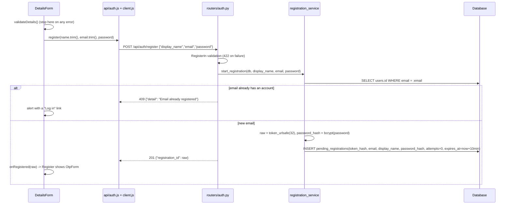
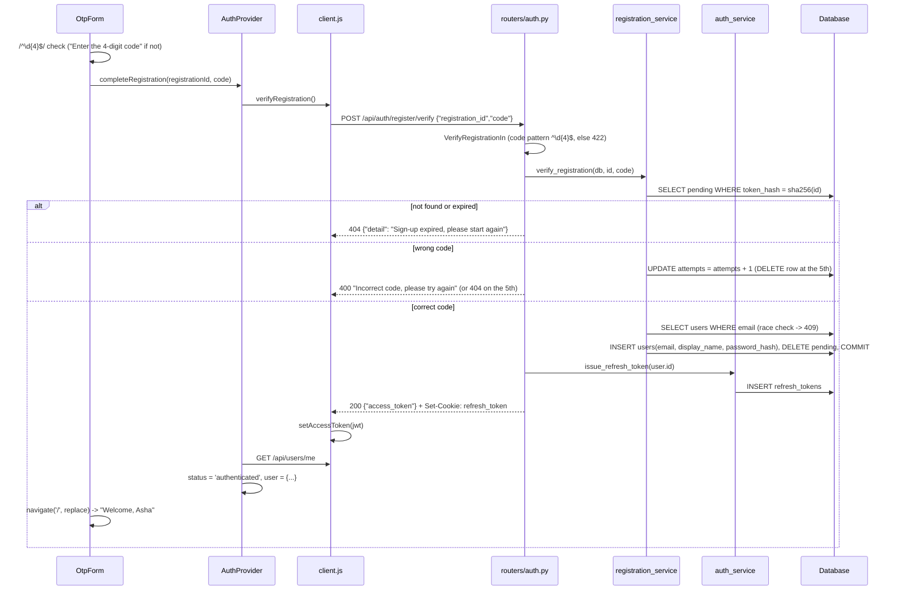

# EM-3 Data Flow: User Registration with OTP

This document explains how the React frontend and the FastAPI backend exchange data when a visitor signs up and confirms the sign-up with a one-time passcode (OTP), and why the flow is designed this way. It builds on the token, cookie and session mechanics described in [EM-2-login-dashboard-logout.md](EM-2-login-dashboard-logout.md).

Design references: [authentication.md](../planning/references/authentication.md), [api_design.md](../planning/references/api_design.md), [data_model.md](../planning/references/data_model.md).

## 1. Overview

Sign-up takes two requests. The account exists only after the second one succeeds.

```
 Details step                           OTP step                               Logged in
┌───────────────────┐  POST /register  ┌───────────────────┐  POST /verify    ┌───────────┐
│ name, email,      │ ───────────────► │ 4-digit code      │ ───────────────► │ Dashboard │
│ password, confirm │ ◄─────────────── │ Verify  |  Back   │ ◄─────────────── │ "Welcome" │
└───────────────────┘ registration_id  └───────────────────┘ access token +   └───────────┘
        ▲                                   │     │              refresh cookie
        │               Back (client only)  │     │ 404: out of attempts / expired
        └───────────────────────────────────┴─────┘
```

| Part | Code | Role |
|---|---|---|
| Register page | `frontend/src/pages/Register/Register.jsx` | Holds the step state: `details`, `registrationId`, `notice` |
| Details form | `frontend/src/pages/Register/DetailsForm.jsx` | Browser validation; calls `POST /api/auth/register` |
| OTP form | `frontend/src/pages/Register/OtpForm.jsx` | Code validation; calls `completeRegistration()` |
| API functions | `frontend/src/api/auth.js` | `register()`, `verifyRegistration()` |
| Auth state | `frontend/src/auth/AuthProvider.jsx` | `completeRegistration()` stores the token and loads the user |
| Routes | `backend/app/routers/auth.py` | `POST /api/auth/register`, `POST /api/auth/register/verify` |
| Schemas | `backend/app/schemas/auth.py` | `RegisterIn`, `RegistrationOut`, `VerifyRegistrationIn` |
| Service | `backend/app/services/registration_service.py` | Pending sign-up lifecycle and code check |
| Tables | `pending_registrations`, then `users` and `refresh_tokens` | See section 7 |

## 2. Why sign-up is split into two requests with a pending table

The ticket says the account must be created **only** after the correct OTP, and that an abandoned sign-up must leave no account and must not block the email. Several designs could satisfy that. This one was chosen for these reasons:

| Alternative | Problem |
|---|---|
| Create the `users` row at once with `is_verified = false` | An abandoned sign-up leaves an account row, and the unique `users.email` blocks the next attempt. Every query would also have to filter unverified users. |
| Keep the details only in the browser and send everything at verify time | The server cannot count wrong attempts or expire the sign-up. A client could simply keep retrying codes. |
| **`pending_registrations` table (chosen)** | `users` only ever holds real accounts. The server owns the attempt counter and the expiry. `email` is not unique there, so an abandoned sign-up blocks nothing. |

The server returns an **opaque `registration_id`** instead of keying the second step on the email address:
- A caller cannot guess or target someone else's pending sign-up by email. The id is 256 random bits (`secrets.token_urlsafe(32)`).
- Only its SHA-256 hash is stored (`token_hash`), as with refresh tokens, so a database leak exposes no usable ids.
- The frontend keeps it only in React state (memory). It is never put in the URL, `localStorage` or a cookie, and it is lost on reload, which counts as abandoning the sign-up.

## 3. Flow A: submitting sign-up details



**Request on the wire**
```http
POST /api/auth/register
Content-Type: application/json

{"display_name": "Asha", "email": "Asha@Example.com", "password": "longenough"}
```

**Response on the wire**
```http
HTTP/1.1 201 Created
Cache-Control: no-store

{"registration_id": "k3Jx...43 URL-safe characters"}
```

**Validation on both sides.** The browser checks give instant, specific messages. The server checks are the authority.

| Rule | Browser (`validateDetails`) | Server (`RegisterIn`) |
|---|---|---|
| Name required, max 100 characters | "Name is required"; `maxLength={100}` on the input | `Field(min_length=1, max_length=100)` after stripping whitespace |
| Email required and well-formed | "Email is required" / "Enter a valid email address" (simple `a@b.c` pattern) | `EmailStr` (full syntax check), then lowercased |
| Password at least 8 characters | "Password must be at least 8 characters" | 8 to 72 **bytes** (UTF-8) |
| Password at most 72 bytes | "Password is too long" (`TextEncoder` byte count) | same rule |
| Both passwords match | "Passwords do not match" | not sent; only one password goes to the server |
| No extra fields | n/a | `extra="forbid"`: a client cannot set `is_active` or `id` |

Why these rules:
- **Passwords are limited in bytes, not characters.** bcrypt uses only the first 72 bytes. Without the limit, two passwords that differ only after byte 72 would both be accepted as the same password. A non-ASCII password can reach 72 bytes with far fewer characters.
- **Emails are lowercased on the server.** Emails are case-insensitive by the business rule, so `Asha@Example.com` and `asha@example.com` are one account. Lowercasing before both the duplicate check and the insert makes the unique index on `users.email` enforce that.
- **The 409 check runs before any hashing.** A duplicate email fails fast. The API answers 409 because the ticket requires telling the visitor the email is taken, with a link to log in. That does reveal which emails are registered. Login deliberately hides this (see EM-2), but sign-up cannot without email delivery. API Gateway rate limiting on `/api/auth/register*` limits bulk probing.
- **The password is hashed here, once.** The plain password crosses the network once, in this request (over HTTPS in production). Only its bcrypt hash is stored and later copied to `users`, so the OTP step never needs the password again.
- **If the server rejects a field anyway (422)**, for example an address the simple browser pattern accepts but `EmailStr` rejects, `serverFieldErrors()` maps FastAPI's `detail[].loc` (`["body", "email"]`) to a message under the matching input.

## 4. Flow B: verifying the OTP



**Request on the wire**
```http
POST /api/auth/register/verify
Content-Type: application/json

{"registration_id": "k3Jx...", "code": "2211"}
```

The success response is identical to a successful login (EM-2): the same `TokenOut` body and the same `Set-Cookie: refresh_token=...; HttpOnly; Path=/api/auth; SameSite=strict`. From this point on, the new user's session behaves like any other: token refresh, idle timeout and logout work unchanged.

Why it works this way:
- **The code and the attempt counter live on the server.** A browser-side check could be skipped with a direct API call. `attempts` is stored in the pending row and increased in the same transaction that rejects the code. The 5th wrong code (`REGISTRATION_MAX_ATTEMPTS`) deletes the row, so the only way on is a new `/register`. At 4 digits and 5 tries, a guesser has a 5 in 10,000 chance per sign-up.
- **Three different failure codes.** Each one tells the frontend what to do next:

  | Status | Meaning | UI action |
  |---|---|---|
  | 400 | Wrong code, tries remain | Stay on the OTP screen, show "Incorrect code, please try again", clear the input |
  | 404 | Registration unknown, expired or out of tries | Return to the details step with "Too many incorrect codes, or the code expired. Please sign up again." |
  | 409 | The email got an account while this sign-up was pending | Stay on the OTP screen with the generic error; the user can go Back |
  | 422 | Malformed body | Not reached in normal use: the browser blocks non-4-digit codes first |

- **The email is checked again at verify time.** Two pending sign-ups for the same email can exist, and the first one to verify wins. The second gets 409 and its row is deleted, instead of failing on the unique index with a 500.
- **One commit creates the user and deletes the pending row.** There is no moment where both, or neither, exist.
- **The new user is logged in with the same code path as login.** The router calls the EM-2 functions `issue_refresh_token` and `create_access_token`, so there is one way to start a session. On the frontend, `completeRegistration()` mirrors `login()`: store the token, `GET /api/users/me`, set `authenticated`.
- **The OTP is fixed for now, in one place.** `_expected_code()` returns `REGISTRATION_OTP` (`2211`). When codes are emailed, only `start_registration` (generate, store and send a code) and `_expected_code` (read the stored code) change. The API and the frontend stay the same.

## 5. Flow C: Back, leaving, and starting again

| User action | Network traffic | Server state | Result |
|---|---|---|---|
| **Back** on the OTP screen | none | Pending row stays until it expires | Details form shows the same values (kept in `Register`'s `details` state) |
| Resubmit details after Back | `POST /register` again | A **new** pending row with a new id; the old row is orphaned | OTP screen with the new id |
| Close the tab or reload on the OTP screen | none | Pending row expires after 10 minutes | No account exists. The same email can sign up again at once, because `pending_registrations.email` is not unique. |
| 5th wrong code | `POST /register/verify` → 404 | Row deleted | Details step with a notice; the details are kept for a quick retry |

Back is handled entirely in the browser: it sets `registrationId` to `null`, and nothing tells the server. That is safe because a pending row grants nothing by itself. It needs the id, which is now discarded, plus the right code, and it expires on its own.

## 6. Route access

`/register` sits inside `GuestOnly`, like `/login`:
- While the session check on app start is still running (`status === 'loading'`), nothing renders.
- A logged-in user who opens `/register` is redirected to `/`.
- After a successful verify, the explicit `navigate('/')` and the guard both send the user to the dashboard. The dashboard reads `user.display_name` from context and shows "Welcome, Asha".

Both `POST /api/auth/register` and `POST /api/auth/register/verify` are public, since a visitor has no token yet. They are on the public auth router and on the `PUBLIC_PATHS` allow-list in `tests/integration/test_users.py`. Every other route is still required to return 401 without a token.

## 7. Data at rest

**`pending_registrations`** (migration `0002`):

| Column | Written | Purpose |
|---|---|---|
| `token_hash` (unique) | `/register` | SHA-256 of the `registration_id`; the lookup key |
| `email` | `/register` | Lowercase; not unique |
| `display_name` | `/register` | Copied to `users` |
| `password_hash` | `/register` | bcrypt; copied to `users`, so the password is never hashed twice |
| `attempts` | each wrong code | Row deleted when it reaches 5 |
| `expires_at` | `/register` | now + `REGISTRATION_MINUTES` (10) |
| `created_at` | `/register` | UTC |

Lifecycle of the data:

```
/register ─► pending row ─┬─ correct code ─► users row + refresh_tokens row; pending row deleted
                          ├─ 5th wrong code ─► pending row deleted
                          ├─ expiry ─► row ignored by lookups (still in the table)
                          └─ Back / tab closed ─► row left until expiry
```

Expired or orphaned rows are ignored by `_find_pending` (`expires_at <= now` → not found), but nothing deletes them yet. A periodic cleanup, like the one planned for expired refresh tokens, can remove them.

## 8. Settings

| Setting | Default | Used by |
|---|---|---|
| `REGISTRATION_OTP` | `2211` | `_expected_code()` |
| `REGISTRATION_MINUTES` | `10` | Pending row expiry |
| `REGISTRATION_MAX_ATTEMPTS` | `5` | Wrong codes allowed before the row is deleted |

All three live on the single `Settings` class, so tests and deployments can change them without code changes.

## 9. Known limitations

- **No email delivery yet:** the code is always `2211`, and the OTP screen does not show it.
- **Pending rows are never deleted** after they expire or are abandoned; see section 7.
- **Two simultaneous correct submissions for the same `registration_id`:** on SQLite they are serialized by `BEGIN IMMEDIATE`, so the second finds no row and gets 404. On PostgreSQL both could pass the email check before either commits, and the second would fail on the unique `users.email` index with a 500. This case is not covered by tests.
